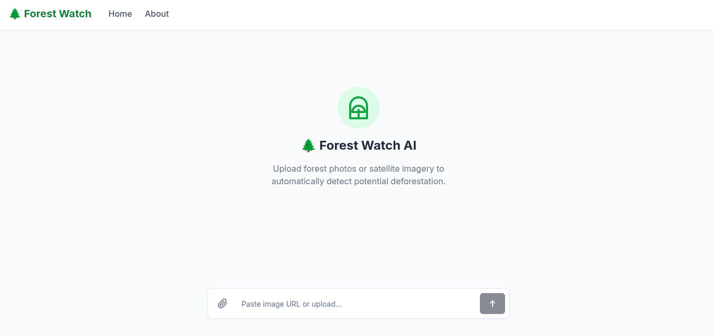
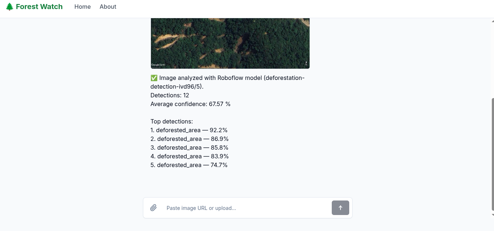
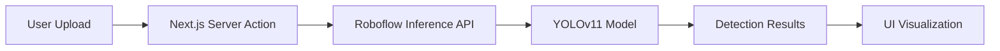

# 🌲 Forest Watch AI: Sumatra Deforestation Detection System

> **AI-Powered Real-Time Monitoring for Tropical Rainforest Conservation**

[](https://nextjs.org/)
[](https://www.typescriptlang.org/)
[](https://docs.ultralytics.com/)
[](https://tailwindcss.com/)

[🚀 Live Demo](https://forest-watch.itsfarid.com/) | [📄 Report/Documentation](link-to-your-pdf-if-any)

---

## 📋 Table of Contents

- [🌲 Forest Watch AI: Sumatra Deforestation Detection System](#-forest-watch-ai-sumatra-deforestation-detection-system)
  - [📋 Table of Contents](#-table-of-contents)
  - [📸 Preview](#-preview)
  - [🎯 Project Overview](#-project-overview)
    - [🌊 Background](#-background)
    - [🌍 The Problem](#-the-problem)
    - [💡 The Solution](#-the-solution)
  - [🛠️ Tech Stack](#️-tech-stack)
    - [🤖 AI \& Machine Learning](#-ai--machine-learning)
    - [💻 Web Application](#-web-application)
  - [🔬 Dataset \& Methodology](#-dataset--methodology)
    - [📊 Model Performance (v5)](#-model-performance-v5)
  - [🚀 Key Features](#-key-features)
  - [🏗️ Architecture](#️-architecture)
  - [💻 Installation \& Setup](#-installation--setup)
    - [Prerequisites](#prerequisites)
    - [Steps](#steps)
  - [📖 Usage](#-usage)
    - [For End Users](#for-end-users)
    - [For Developers](#for-developers)
  - [🎯 Future Improvements](#-future-improvements)
  - [🙏 Acknowledgments](#-acknowledgments)
  - [📧 Contact \& Support](#-contact--support)
  - [📄 License](#-license)
  - [👨‍💻 Author](#-author)

---

## 📸 Preview

| Dashboard Interface | Detection Result |
| :---: | :---: |
|  |  |

*(Replace the image paths above with actual screenshots from your project. Make sure they look good!)*

---

## 🎯 Project Overview

**Forest Watch AI** is an automated detection system designed to monitor active deforestation in Sumatra's tropical rainforests. By combining **Computer Vision (YOLOv11)** with a modern **Next.js** web interface, this project aims to provide an accessible tool for environmental monitoring.

### 🌊 Background
This project was inspired by the major flooding disasters that struck several regions in Sumatra recently — one of the contributing factors being deforestation and large-scale land-use conversion of forest areas. As a student who grew up caring about environmental issues, I wanted to contribute in a way I'm equipped to: through technology. **Forest Watch AI** is a small step toward helping detect deforestation activity earlier, so that similar disasters can be minimized in the future.

### 🌍 The Problem
Deforestation in Sumatra is critical. Traditional monitoring fails due to:
* Vast geographical coverage.
* Difficult terrain accessibility.
* Inability to distinguish active clearing from established plantations.

### 💡 The Solution
* **Automated Detection:** Uses YOLOv11 to identify visual patterns of active clearing.
* **Accessible Interface:** Web-based platform for easy image upload and real-time inference.
* **Rigorous Data Methodology:** Manual annotation from high-resolution satellite imagery (Google Earth Pro) to ensure spatial consistency.

---

## 🛠️ Tech Stack

### 🤖 AI & Machine Learning
* **Model:** YOLOv11s (Optimized for speed/accuracy balance)
* **Training Platform:** Roboflow (Cloud GPU Infrastructure)
* **Data Source:** Google Earth Pro (Historical Imagery)
* **Preprocessing:** Auto-orient, Resize (640x640), Augmentation

### 💻 Web Application
* **Framework:** Next.js 14 (App Router)
* **Language:** TypeScript
* **Styling:** Tailwind CSS + Shadcn/UI
* **Inference:** Roboflow Inference API
* **Deployment:** Vercel

---

## 🔬 Dataset & Methodology

Unlike randomly scraped datasets, this project uses a **measurement-based approach** for higher accuracy.

| Metric | Value |
| :--- | :--- |
| **Source** | Google Earth Pro (Aceh Tamiang, South Tapanuli, Agam) |
| **Altitude** | 1000m - 2000m (Consistent Scale) |
| **View Angle** | Top-down (Perpendicular) |
| **Total Images** | 122 Validated Images |
| **Annotated** | 61 Images (Initial Phase) |
| **Split Ratio** | 70% Train / 20% Val / 10% Test |

### 📊 Model Performance (v5)
Trained for 190 epochs with early stopping.

* **mAP@50:** `39.4%`
* **Precision:** `42.5%`
* **Recall:** `47.7%`

> **Note:** Metrics reflect the initial training phase. The model demonstrates good convergence and feature learning despite limited data. Future iterations will expand the dataset to 500+ images.

---

## 🚀 Key Features

* ⚡ **Real-Time Inference:** Get detection results in seconds via Server Actions.
* 🖱️ **Drag & Drop Upload:** User-friendly interface for satellite images.
* 📊 **Confidence Visualization:** Bounding boxes with confidence scores displayed directly on the image.
* 🔒 **Privacy-Focused:** Temporary processing only; no permanent storage of user uploads.
* 📱 **Fully Responsive:** Optimized for both desktop and mobile devices.

---

## 🏗️ Architecture



---

## 💻 Installation & Setup

### Prerequisites
* Node.js 18+
* Roboflow Account & API Key

### Steps

1. **Clone the repository**
    ```bash
    git clone https://github.com/itsfarid/forest-watch.git
    cd forest-watch
    ```

2. **Install dependencies**
    ```bash
    npm install
    # or
    pnpm install
    ```

3. **Configure Environment Variables**
    Create a `.env.local` file in the root directory:
    ```env
    ROBOFLOW_API_KEY=your_api_key_here
    ROBOFLOW_MODEL_ID=deforestation-detection-ivd96/5
    ROBOFLOW_CONFIDENCE_THRESHOLD=0.5
    ```

4. **Run Development Server**
    ```bash
    npm run dev
    ```
    Open [http://localhost:3000](http://localhost:3000) in your browser.

---

## 📖 Usage

### For End Users
1. Visit the [Live Demo](https://forest-watch.itsfarid.com/).
2. Upload a satellite image (JPEG/PNG).
3. Wait for processing (2-5 seconds).
4. View detection results with bounding boxes.

### For Developers
You can integrate the detection API into your own projects:

```typescript
const response = await fetch('/api/detect', {
  method: 'POST',
  body: formData // Contains the image file
});

const results = await response.json();
console.log(results); // Array of detections with coordinates & confidence
```

---

## 🎯 Future Improvements

- [ ] Expand dataset to 500+ annotated images for higher mAP.
- [ ] Implement temporal analysis (change detection over time).
- [ ] Add batch processing for multiple images.
- [ ] Integrate with live satellite data feeds (e.g., Sentinel-2).
- [ ] Develop a mobile app for field workers.

---

## 🙏 Acknowledgments

- **Google Earth Pro** for satellite imagery
- **Roboflow** for training infrastructure

## 📧 Contact & Support

For questions, suggestions, or collaboration opportunities:
- Create an issue on [GitHub](https://github.com/itsfarid/forest-watch/issues)
- Visit the live demo at [forest-watch.itsfarid.com](https://forest-watch.itsfarid.com/)

⭐ If you find this project useful, please consider giving it a star!

---

## 📄 License

This project is licensed under the **MIT License**. See the [LICENSE](LICENSE) file for details.

---

## 👨‍💻 Author

**Farid Farhan**
Software Engineering Student | Security Researcher | Backend Developer

* 🌐 [Portfolio](https://itsfarid.com/)
* 💼 [LinkedIn](https://linkedin.com/in/itsfarid)
* 🐙 [GitHub](https://github.com/itsfarid)